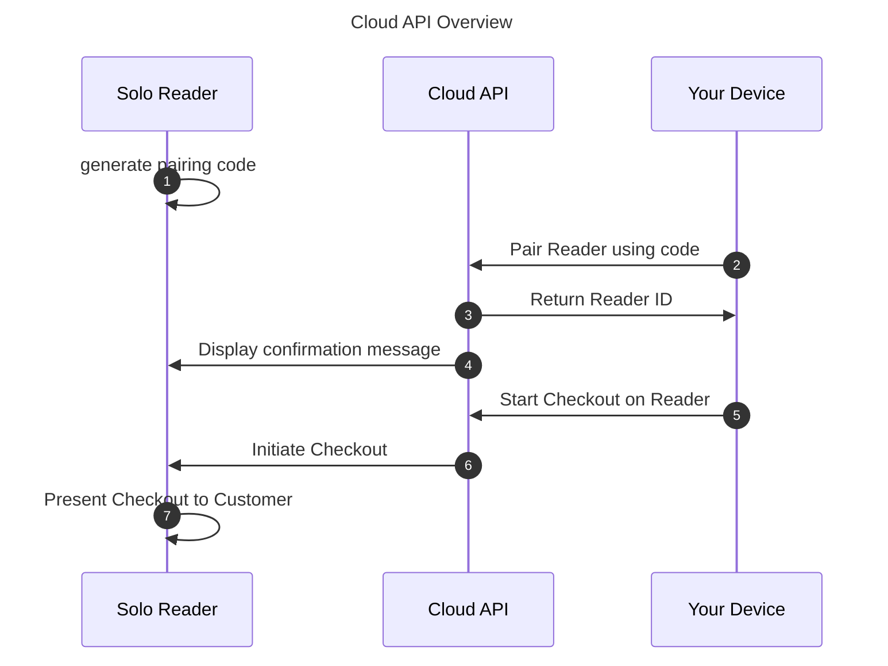

import { Aside, Steps } from '@astrojs/starlight/components';
import Video from '@components/content/Video.astro';
import SoloScreen from '@components/content/SoloScreen.astro';
import { cloudapiname } from '@lib/productnames.ts';

## About Payments with Cloud API

The { cloudapiname } lets you start a transaction from a Point of Sale (POS) running on any platform (Windows, iOS, Linux, Android, Web-based, etc.) capable of sending HTTPS requests and complete that transaction via a Solo reader.

Key advantages include:

* Compatibility with any operating system and platform
* Ability to process simultaneous transactions on multiple Solo card readers at once
* No distance limitation between your POS device and the Solo card reader; transactions can be sent remotely
* No Bluetooth connection required
* PCI compliance, ensuring secure and compliant transactions

The { cloudapiname } integration supports:

* Debit, credit, and installment transactions
* Pairing multiple Solo card readers with any SumUp account
* Naming each Solo card reader as desired to streamline checkout
* Wi-Fi and mobile data connectivity (mobile data needs manual enabling by SumUp)

## Prerequisites

* Your device must be authorized to use the { cloudapiname }. [Refer to the authorization guide](/tools/authorization/authorization/) and implement the method that best fits your use case. An API key should be sufficient if you don’t plan to delegate access to third parties.
* You must [create an Affiliate Key](/tools/authorization/affiliate-keys/) for your app, as SumUp { cloudapiname } requires this key in checkout requests.
* We strongly recommend keeping the Solo terminal plugged in when using the { cloudapiname }.
* If you want to use mobile data, ensure you are not connected to Wi-Fi. Disconnect from Wi-Fi if necessary—when both mobile data and Wi-Fi are available, the Solo reader will always use Wi-Fi.

  To disconnect Wi-Fi, navigate to **Connections** > **Wi-Fi** and disable Wi-Fi using the on-screen slider.

## Solo Virtual Terminal

If you don’t have a Solo reader yet, you can try out the flow using the [Virtual Solo](https://virtual-solo.sumup.com) with a [SumUp test account](/online-payments/#getting-a-test-account).

Virtual Solo works like the real device but with some limitations. The following actions are not supported virtually:

* Physical card insertion or tap simulation (since there is no physical Solo device)
* Real funds transfer (test accounts only)
* PIN entry simulation (always auto-approved)
* Offline transactions
* Custom receipt printing
* Network configuration
* Real device pairing (the simulator uses virtual device identifiers)

## Pairing Solo Reader via Cloud API

The { cloudapiname } acts as a bridge between your application and the Solo reader. It supports two main processes:

* Pairing a Solo reader to your account
* Taking in-person payments via Solo

Once the Solo reader is paired to your SumUp account, your application can initiate a card charge request. SumUp handles the rest, providing a seamless payment experience where all card data is encrypted end-to-end. Transaction results are available in real-time via webhooks.

### Log Out of Solo

The { cloudapiname } pairing process is only available for logged-out users. If you're logged in to your merchant account, do the following:

1. Open the top-side menu on your Solo.
2. Select **Settings**. The **Device settings** menu opens.
3. Go to the **About** section.
4. Select **Log out**. Solo should now display the login screen.

### Generate Pairing Code

To initiate a payment on the Solo card reader, it must be enrolled with the merchant account. This enrollment, called reader pairing, starts on the card reader by generating a pairing code and finishes when your device completes a pairing request using the { cloudapiname } with that code. Both your application and Solo reader must be connected to the internet (not necessarily the same network).

<Aside type="note">

The pairing process has an expiration time of 5 minutes, if any issue occurs, the
process must be restarted.

</Aside>

1. Turn on the Solo card reader.
2. Make sure you're not logged in. [Log out from your Solo card reader](#log-out-of-solo) if you are.
3. Open the top menu drawer
4. Go to **Connections** and connect to Wi-Fi (connecting is skipped in the short video below).
5. Select **API**.
6. Click **Connect**. The pairing code is generated.
7. Copy the pairing code displayed on the
Solo card reader screen. You will need this code to pair your Solo reader with your device.

<Video src="/img/guides/pair_solo.mp4" trackSrc="/img/guides/pair_solo.vtt" width="400px" height="400px" />

### Pair the Card Reader With Pairing Code

<Steps>
1. Send a request to the [Create Reader endpoint](/api/readers/create).
2. Verify pairing confirmation on the reader screen. It appears for a short while, after which the reader returns to the idle screen.

</Steps>

<SoloScreen src="/img/guides/solo-pairing-step-7.png" alt="Solo device API pairing confirmation screen." />

## Using Paired Reader

{ cloudapiname } lets you manage transactions and readers connected to your account.

### Initiate Transaction

This is an asynchronous process; starting the transaction on the device may take some time.

Important notes:

* The target device must be online, otherwise checkout won't be accepted
* After the checkout is accepted, the system has 60 seconds to start the payment on the target device. During this time, any other checkout for the same device will be rejected.
* You need to send the Affiliate Key in the request.

Read the [Create Checkout API endpoint documentation](/api/readers/create-checkout) for details on the API request, examples, and parameter descriptions.

### Terminate Transaction

Stops the current transaction on the target device.
This process is asynchronous, and the actual termination may take some time to be performed on the device.

Important notes:

* The target device must be online, otherwise termination won't be accepted.
* This action is only possible if the device is waiting for cardholder action: waiting for card, waiting for PIN, etc.
There is no confirmation of the termination.
* If a transaction is successfully terminated and `return_url` has been provided on Checkout, the transaction status is sent as failed to the provided URL.

Read the [Terminate Checkout API endpoint documentation](/api/readers/terminate-checkout) for details on the API request, examples, and parameter descriptions.

### List Connected Readers

List all readers connected to your merchant account.

Read the [List API endpoint documentation](/api/readers/list) for details on the API request, examples, and parameter descriptions.

### Check Reader Status

Check the status of a specific reader. 

Read the [Retrieve a Reader endpoint documentation](/api/readers/get) for details on the API request, examples, and parameter descriptions.

### Update Reader

Update the data of a specific reader. 

Check the [Update a Reader endpoint documentation](/api/readers/update) for details on the API request, examples, and parameter descriptions.

### Delete Reader

Delete a reader from the { cloudapiname }. After doing this, you also need to physically disconnect the reader using its menu.

Check the [Delete a Reader endpoint documentation](/api/readers/delete) for details on the API request, examples, and parameter descriptions.

## Unpairing Solo Reader

In order to unpair a reader from the merchant account, two steps are required:

1. [Delete Reader](#delete-reader) from the Merchant account (via Readers API).
2. [Disconnect Reader](#diconnect-reader) (manually via Solo).

### Disconnect Reader Physically

<Steps>

1. Open the menu drawer on your Solo.
2. Go to **Connections**.
3. Select **API** from the menu.
4. Tap on **Disconnect**.

</Steps>

Your Solo device is now disconnected.

## What's Next?

For other integration possibilities, check the [SDK Integration Documentation](/terminal-payments/sdks/).
