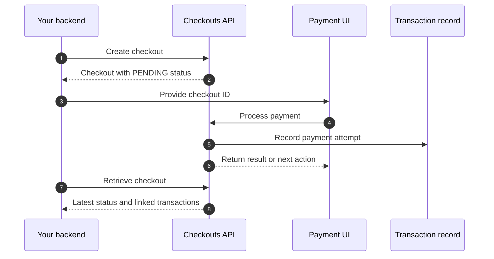

A Checkout is a request or session that tells SumUp to collect a specific
amount in a specific currency. It connects the commercial intent represented
by a [Sale](/tools/glossary/sale/) with payment processing.

A Checkout commonly contains:

- The amount and currency to collect
- The merchant receiving the payment
- A merchant-defined reference
- Optional customer, expiration, redirect, and callback details
- Its current status and any linked
  [Transactions](/tools/glossary/transaction/)

A Checkout is not proof that payment succeeded. It can exist before any payment
attempt and can remain `PENDING`, fail, or expire without a successful
Transaction.

## Checkout Types in the Public APIs

The Developer Portal uses Checkout in two related payment flows:

- The **Checkouts API** creates an online Checkout, processes it with a payment
  instrument, and retrieves its latest state. Start with
  [Create a checkout](/api/checkouts/create), then use a supported integration
  such as the [Payment Widget](/online-payments/checkouts/card-widget/) or
  [Hosted Checkout](/online-payments/checkouts/hosted-checkout/).
- The **Readers API** creates a Checkout on a paired card reader. This starts an
  asynchronous in-person payment flow. See
  [Create a Reader Checkout](/api/readers/create-checkout).

These resources have different endpoint shapes and lifecycles, but serve the
same conceptual purpose: they coordinate how a payment should be attempted.

## Typical Online Checkout Flow

For redirect-based payment methods or 3DS, processing can return a next action
instead of a final result. Always use
[Retrieve a checkout](/api/checkouts/get) from your backend to confirm the
latest Checkout status.

## Relationship to a Sale and Transaction

- The **Sale** describes the items, taxes, discounts, customer, and other
  commercial context.
- The **Checkout** carries the amount, currency, and instructions needed to
  attempt payment.
- Processing the Checkout creates or updates a **Transaction**, which records
  the financial result.

A newly created Checkout can have an empty `transactions` array. Payment
processing attaches Transaction records as attempts occur. Use the Checkout to
manage the payment flow; use the
[Transactions API](/api/transactions/get) for transaction details, history,
and post-payment operations.
