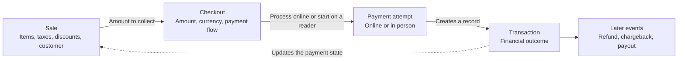

A Sale is the commercial record of an exchange between a merchant and a
customer. It answers **what was sold**, independently of how the customer paid.

A Sale can contain business details such as:

- Items and quantities
- Taxes, discounts, and tips
- Customer information
- The sales channel, device, or location
- The total amount and payment state

A Sale can exist before payment, be paid by one or more
[Transactions](/tools/glossary/transaction/), or use a payment method that does
not require a SumUp Checkout. This makes a Sale broader than a payment record.

## How Sales, Checkouts, and Transactions Relate

Use these terms to describe different parts of the same flow:

- **Sale**: what the customer is buying
- **[Checkout](/tools/glossary/checkout/)**: the request or session used to
  collect an amount
- **[Transaction](/tools/glossary/transaction/)**: the recorded outcome of a
  payment attempt or later financial operation

The exact relationship depends on the integration. For example, a merchant can
split one Sale across multiple payments, while an online purchase commonly
uses one Checkout to create one successful Transaction.
