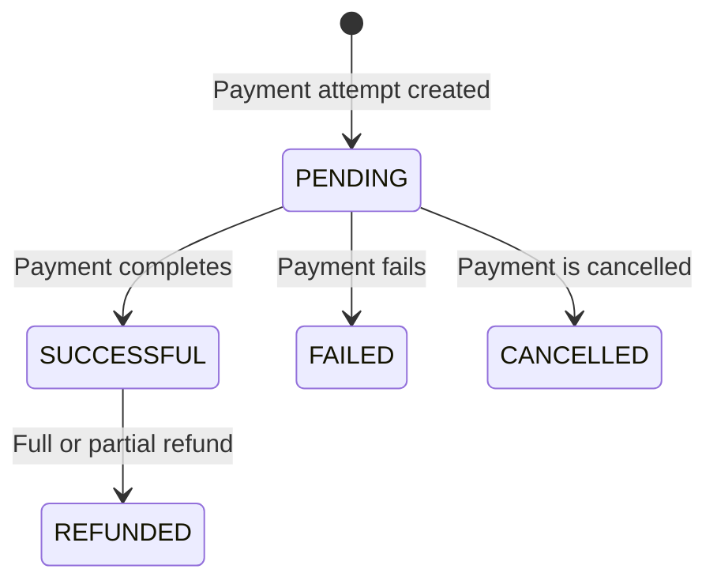

A Transaction is a financial record created when a payment is attempted or a
related operation is processed. It answers **what happened to the money**.

A Transaction can include:

- The amount and currency
- Its processing status
- The payment type and entry mode
- SumUp and merchant-provided identifiers
- Card, device, payout, refund, and other event details where applicable

Unlike a [Sale](/tools/glossary/sale/), a Transaction does not describe the full
basket or commercial context. Unlike a
[Checkout](/tools/glossary/checkout/), it is not an instruction to collect a
payment: it records the result of processing one.

## Transaction Lifecycle

The Transaction status is separate from the Checkout status. For example, a
Checkout can be `PENDING` while a redirect-based payment is still being
completed, and its linked Transaction can also have its own `PENDING` state.

## Transactions in the Public APIs

The Transactions API supports the post-payment lifecycle:

- [Retrieve a transaction](/api/transactions/get) by its SumUp ID, transaction
  code, foreign transaction ID, or client transaction ID
- [List transactions](/api/transactions/list) for a merchant and filter the
  history by status, payment type, entry mode, or transaction type
- [Refund a transaction](/api/transactions/refund/) in full or partially

Transaction history can include payments, refunds, and chargebacks. A full
Transaction resource can also contain events related to refunds, chargebacks,
payouts, and payout deductions.

## Relationship to a Sale and Checkout

A typical online flow starts with a Sale or order in your system. You create a
Checkout for the amount to collect, then process it. The payment attempt creates
a Transaction, and the Checkout response links to it through fields such as
`transaction_id`, `transaction_code`, and `transactions`.

Not every Transaction originates from the online Checkouts API. In-person
payments initiated through a reader or mobile SDK also produce Transactions.
Use stable merchant-provided references and store SumUp identifiers so you can
reconcile each Transaction with the correct Sale.
